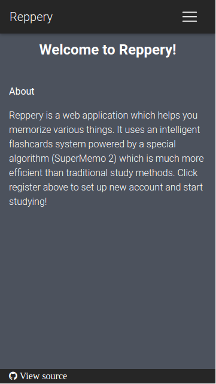
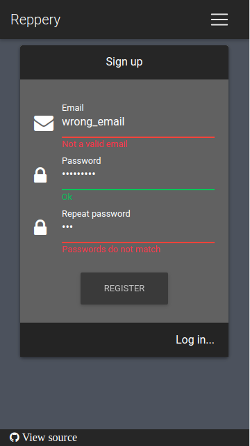
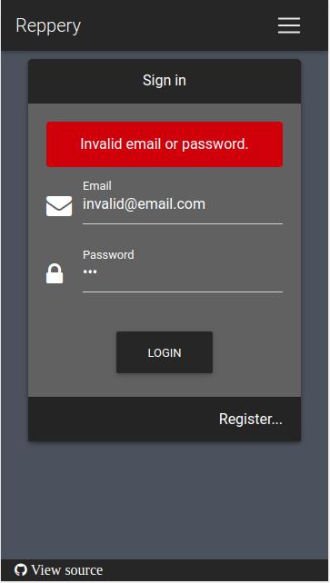
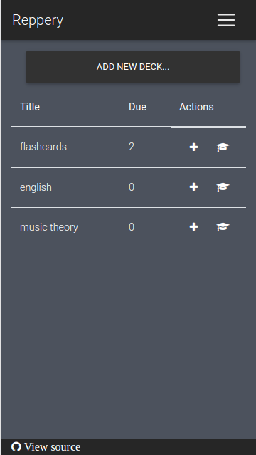
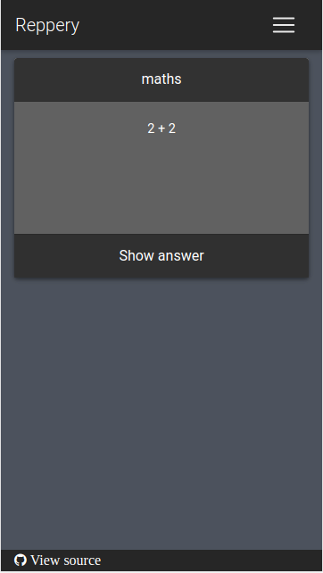
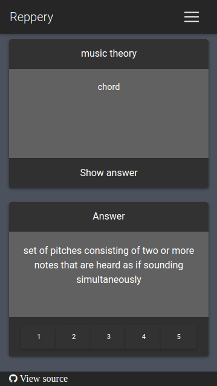

```diff
- Work in progress
```
# reppery [](https://travis-ci.org/szotaa/reppery)  [](https://opensource.org/licenses/MIT)
<a href="https://en.wikipedia.org/wiki/Spaced_repetition">Spaced repetition</a> learning web application implementing 
<a href="https://www.supermemo.com/english/ol/sm2.htm">SuperMemo 2 algorithm.</a>

## goal
Reppery was created as a 'skill showcase' app and hopefully will help me land my first job as a Java developer. 
If you are interested in hiring me, drop me an email at <a href="mailto:kubaszota97@gmail.com">kubaszota97@gmail.com</a>.

## docs
- <a href="https://github.com/szotaa/reppery/wiki">Text documentation</a>
- <a href="https://szotaa.github.io/reppery/">Javadocs</a>

## live version
Live version is accessible <a href="https://reppery.herokuapp.com/">here.</a> Please keep in mind that application is 
running on <a href="https://www.heroku.com/pricing#dynos">free Heroku dyno</a> which means that application could be 
'sleeping' therefore you might need to wait few minutes before it boots up. Reppery is also using free 
<a href="https://sendgrid.com/pricing/">SendGrid</a> plan which limits 100 account registrations per day 
(after exceeding this limit application will not send account activation emails at given day).

## used technologies

* build, deployment, CI/CD
    * Gradle
    * Jacoco Gradle Plugin
    * Travis CI
    * Heroku
    * SonarCloud.io
    
* backend
    * Java 8
    * Groovy
    * Spring
    * Hibernate
    * Lombok
    * JJWT
    * Spock
    * Sendgrid
    * PostgreSQL (production)
    * H2 DB (tests)
    
* frontend
    * HTML
    * SASS
    * MDBootstrap
    * Angular
    

## screenshots






